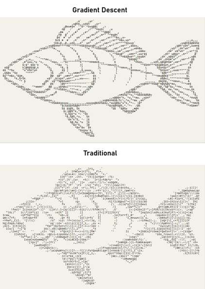
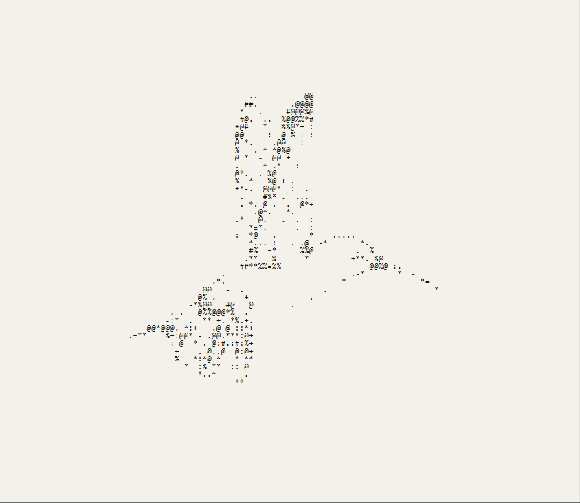
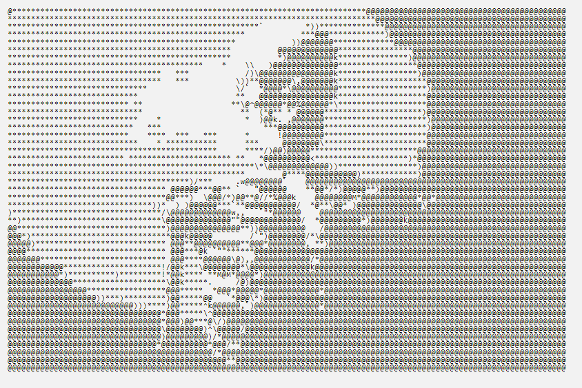

# ASCII-fit

Convert images to ASCII art and animate the result — gradient-descent glyph fitting, wave animation, mouse ripples, and a procedural plasma field, all rendered on a single canvas.


## Features

- **Two fit methods**:
  - `gradient descent` — each cell is matched to the character that minimizes per-glyph reconstruction error.
  - `traditional` — each cell is mapped straight onto a brightness ramp (fast, classic).


- **Lineart → ASCII** — clean, high-contrast line drawings and sketches convert especially well.


- **Text logos / wordmarks → ASCII** — render text, logos, and typography-based graphics into ASCII art.


- **Customizable character sets** — dense, block glyphs, minimal, binary, or a **custom** set you type yourself.


- **Wave animation** — horizontal, vertical, water (dual-axis), radial, turbulence, and 3D perspective modes with amplitude/speed/frequency/phase controls.


- **Mouse ripples** — click or click-drag over the output.
- **Procedural plasma** — summed sine waves mapped to a character ramp and a color band, animatable on top of a fitted image or standalone.


- **Export** — copy the ASCII as text, download as `.txt`, render to `.png`, or export an animated `.gif`.

Everything is processed locally in the browser; no images leave your machine.

**Supported formats:** any image your browser can decode — png, jpg, webp, gif, bmp, avif, svg, and more.

## Usage

Download. Open `index.html` in a browser. Drop any image (png / jpg / webp / gif / svg / …) onto the source panel, adjust the fit parameters, then hit **run fit**. Toggle wave / plasma on and press **export gif** for an animation.

Alternatively, try at: https://codeplusart.github.io/ASCII-fit/

## Project structure

```
index.html   markup
style.css    styles
script.js    application logic (fitting, rendering, animation, GIF export)
LICENSE.txt  GPL-3.0 license
README.md    this file
```

## License

GPL-3.0 — see [LICENSE.txt](LICENSE.txt).
